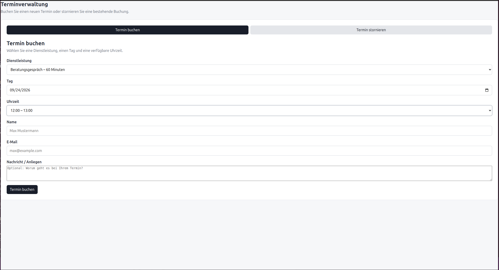
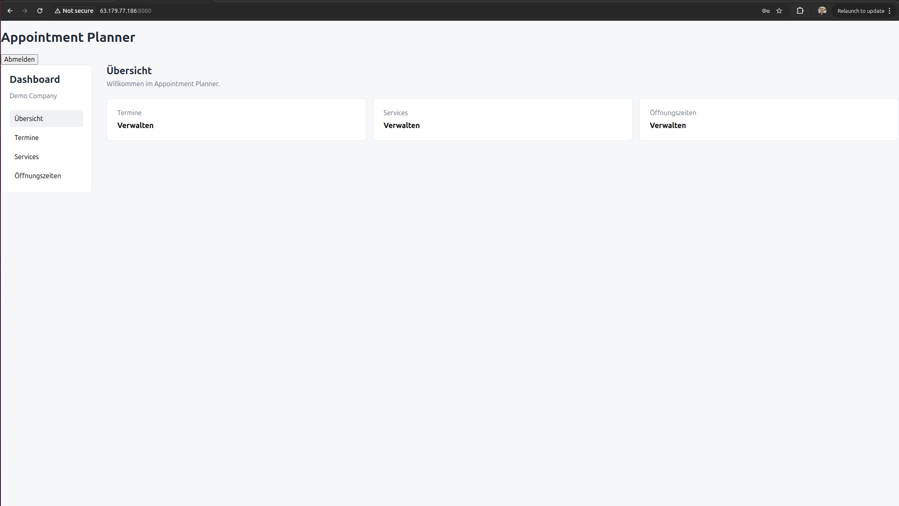
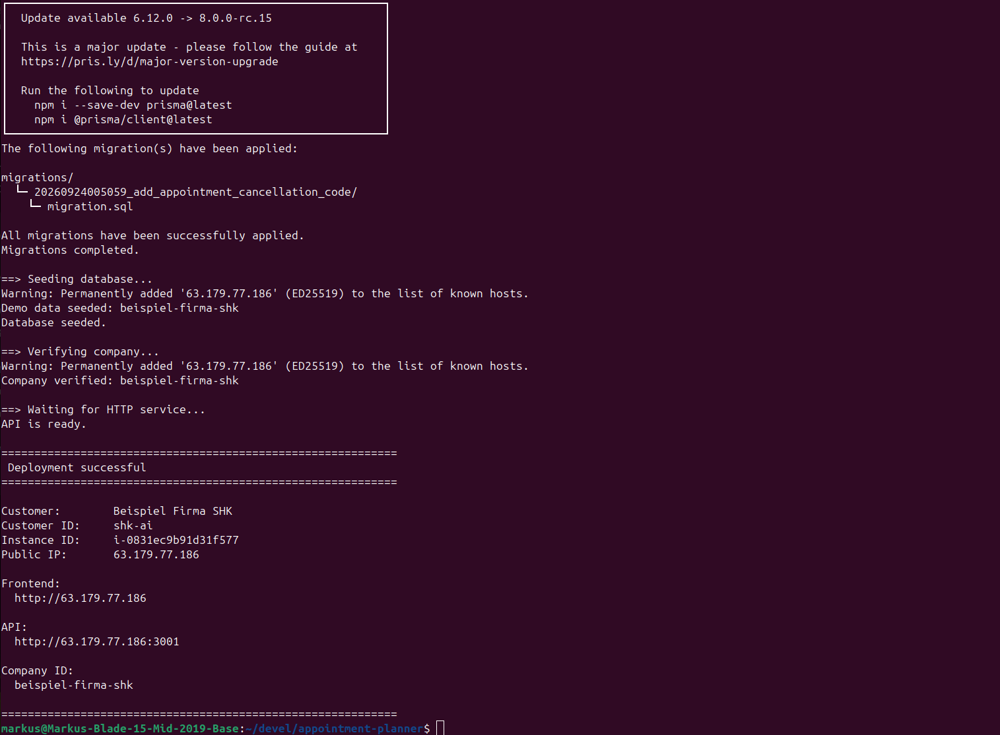

# Appointment Planner

A containerized appointment booking platform for businesses and their customers.

The application provides a complete appointment workflow: customers can select a service, choose an available date and time, and submit a booking. Businesses can manage their appointments through a dedicated administration interface.

The project is currently deployed on **AWS EC2** using **Docker Compose**.

---

## Screenshots

### Customer Booking



Customers can select a service, choose a date and available time slot, and submit an appointment.

### Business Dashboard



Businesses can access their administration interface to manage appointments and company-related information.

### Appointment Management


Appointments can be viewed and managed through the business interface.

---

## Architecture

The current production deployment consists of **one AWS EC2 instance running three separate Docker containers**.


### Current architecture

```text
                         INTERNET
                            │
                ┌───────────┴───────────┐
                │                       │
            Customer              Business / Admin
                │                       │
                └───────────┬───────────┘
                            │
                            ▼
                  ┌─────────────────────┐
                  │    AWS EC2 Instance  │
                  │                     │
                  │  Docker Compose     │
                  │                     │
                  │ ┌─────────────────┐ │
                  │ │ Frontend        │ │
                  │ │ React / Vite    │ │
                  │ │ Nginx           │ │
                  │ │ Port 80 / 8080  │ │
                  │ └────────┬────────┘ │
                  │          │          │
                  │          ▼          │
                  │ ┌─────────────────┐ │
                  │ │ API             │ │
                  │ │ Node.js         │ │
                  │ │ TypeScript      │ │
                  │ │ Fastify         │ │
                  │ │ Prisma          │ │
                  │ │ Port 3001       │ │
                  │ └────────┬────────┘ │
                  │          │          │
                  │          ▼          │
                  │ ┌─────────────────┐ │
                  │ │ PostgreSQL      │ │
                  │ │ Port 5432       │ │
                  │ └─────────────────┘ │
                  └─────────────────────┘
                            │
                            ▼
                       AWS SES
                    E-mail delivery
```

The three application components are separated into individual containers:

* **Frontend container** — React, Vite and Nginx
* **API container** — Node.js, TypeScript, Fastify and Prisma
* **Database container** — PostgreSQL

AWS SES is used as an external AWS service for sending e-mails.

This separation keeps the individual components independent while keeping the current deployment simple and cost-efficient.

---

## Features

### Customer

* Service selection
* Date selection
* Available time slots
* Appointment booking
* Booking confirmation
* E-mail notification

### Business

* Administration interface
* Appointment overview
* Appointment management
* Company-specific configuration
* Service management
* Availability management

### Backend

* REST API
* Company-specific data
* Service management
* Availability calculation
* Appointment validation
* Database persistence
* E-mail delivery via AWS SES

---

## Technology Stack

### Frontend

* React
* TypeScript
* Vite
* Nginx

### Backend

* Node.js
* TypeScript
* Fastify
* Prisma

### Database

* PostgreSQL 16

### Infrastructure

* Docker
* Docker Compose
* AWS EC2
* AWS SES

---

## Docker Architecture

Each major application component runs in its own Docker container.

```text
Docker Compose
│
├── Frontend Container
│   └── React / Vite / Nginx
│
├── API Container
│   └── Node.js / Fastify / Prisma
│
└── PostgreSQL Container
    └── PostgreSQL 16
```

The containers communicate through the Docker Compose network.

The current production deployment runs all three containers on the same EC2 instance.

---

## AWS Deployment

The application is deployed to AWS using an EC2 instance.



Current deployment:

```text
AWS
│
└── EC2 Instance
    │
    └── Docker Compose
        │
        ├── Frontend
        ├── API
        └── PostgreSQL
```

### Public endpoints

| Component      | Port | Purpose                 |
| -------------- | ---: | ----------------------- |
| Frontend       |   80 | Customer booking        |
| Admin Frontend | 8080 | Business administration |
| API            | 3001 | REST API                |
| PostgreSQL     | 5432 | Internal database       |

PostgreSQL is not exposed publicly.

---

## Deployment Automation

The project includes a deployment script for customer-specific deployments.

```text
deploy/
├── deploy.sh
└── customers/
    └── kunde-a.txt
```

A customer configuration contains the required company-specific settings.

The deployment script:

1. Reads the customer configuration
2. Validates the required values
3. Builds the application
4. Transfers the project to EC2
5. Creates the customer-specific `.env`
6. Starts the Docker containers
7. Verifies the deployment

Example:

```bash
DEPLOY_CONFIRM=yes ./deploy/deploy.sh deploy/customers/kunde-a.txt
```

A dry-run is available without modifying the deployment:

```bash
./deploy/deploy.sh deploy/customers/kunde-a.txt
```

Local `.env` files are intentionally excluded from the deployment process.

---

## Availability Logic

Available appointment slots are calculated dynamically by the backend.

The API considers:

* Company timezone
* Weekday availability
* Service duration
* Existing appointments
* Appointment status

A time slot is considered unavailable when it overlaps an existing appointment.

The backend uses overlap detection similar to:

```text
slotStart < appointmentEnd
AND
slotEnd > appointmentStart
```

This prevents already booked periods from being offered as available booking slots.

The frontend additionally filters the returned slots and only displays slots marked as available.

---

## REST API

The backend provides REST endpoints for the booking workflow.

Examples include:

```text
GET  /services
GET  /slots
GET  /appointments
POST /appointments
```

Example slot request:

```text
GET /slots?companyId=<company-id>&serviceId=<service-id>&date=<date>
```

The API is responsible for validating requests and interacting with PostgreSQL.

---

## Database

The application uses PostgreSQL together with Prisma.

Prisma provides the database access layer between the Node.js backend and PostgreSQL.

The database stores information such as:

* Companies
* Services
* Availability periods
* Appointments

The database runs independently inside its own Docker container.

---

## E-Mail Delivery

Appointment-related e-mails are sent through **AWS SES**.

```text
Customer
   │
   ▼
Frontend
   │
   ▼
API
   │
   ▼
AWS SES
   │
   ▼
E-mail recipient
```

The backend uses the AWS SDK and the AWS credential provider chain.

No AWS credentials are stored directly in the application source code.

---

## Multi-Company Architecture

The application is designed around company-specific data.

Each deployment can provide its own:

* Company ID
* Company name
* Company e-mail
* Timezone
* Services
* Availability
* Appointments
* Administration credentials

This allows the same application codebase to be deployed for different businesses with customer-specific configuration.

---

## Scalability

The current deployment is intentionally simple:

```text
1 × EC2
│
├── Frontend Container
├── API Container
└── PostgreSQL Container
```

The application is **not currently running as a horizontally scaled infrastructure**.

However, the separation of frontend, API and database components provides a foundation for future infrastructure scaling.

A potential future architecture could include:

```text
                 Load Balancer
                      │
          ┌───────────┴───────────┐
          │                       │
       API #1                   API #2
          │                       │
          └───────────┬───────────┘
                      │
                  PostgreSQL
```

Depending on future requirements, components could later be moved to services such as:

* AWS Application Load Balancer
* Multiple EC2 instances
* Auto Scaling
* ECS / Fargate
* Amazon RDS
* CloudWatch

These are future scaling options, not part of the current production deployment.

---

## Security & Privacy

Security considerations include:

* Customer-specific configuration
* Environment variables for sensitive configuration
* `.env` excluded from deployment synchronization
* Restricted database exposure
* AWS IAM-based access to AWS services
* SES sender verification
* Separate application containers
* Server-side validation of appointments

Further hardening planned for future production environments includes HTTPS, stronger authentication and additional network restrictions.

---

## Project Structure

```text
appointment-planner/
│
├── backend/
│   ├── src/
│   │   ├── routes/
│   │   └── lib/
│   ├── prisma/
│   └── Dockerfile
│
├── frontend/
│   ├── src/
│   │   ├── components/
│   │   ├── pages/
│   │   └── lib/
│   ├── Dockerfile
│   └── vite.config.ts
│
├── deploy/
│   ├── deploy.sh
│   └── customers/
│
├── docker-compose.yml
├── .env
└── README.md
```

---

## Project Status

The application currently provides a working end-to-end appointment booking workflow.

Implemented:

* Customer booking interface
* Business administration interface
* Service management
* Availability management
* Dynamic slot calculation
* Appointment creation
* PostgreSQL persistence
* E-mail delivery through AWS SES
* Docker containerization
* AWS EC2 deployment
* Customer-specific deployment configuration
* Automated deployment script

---

## Future Development

Potential future improvements include:

* HTTPS / TLS
* More advanced authentication
* Outlook / Microsoft 365 calendar integration
* Calendar feeds using ICS
* Direct Microsoft Graph integration
* Automated backups
* Monitoring and logging
* AWS RDS
* Horizontal API scaling
* Load balancing
* Auto Scaling

---

## What This Project Demonstrates

This project demonstrates practical experience with:

* Full-stack web development
* React and TypeScript
* Node.js backend development
* REST API design
* Fastify
* Prisma
* PostgreSQL
* Docker and Docker Compose
* AWS EC2
* AWS SES
* Environment-based configuration
* Customer-specific deployments
* Deployment automation
* Availability and appointment logic
* Designing an application with future scalability in mind

The current architecture deliberately balances **simplicity, maintainability and deployment cost**, while keeping the individual application components separated for future expansion.

