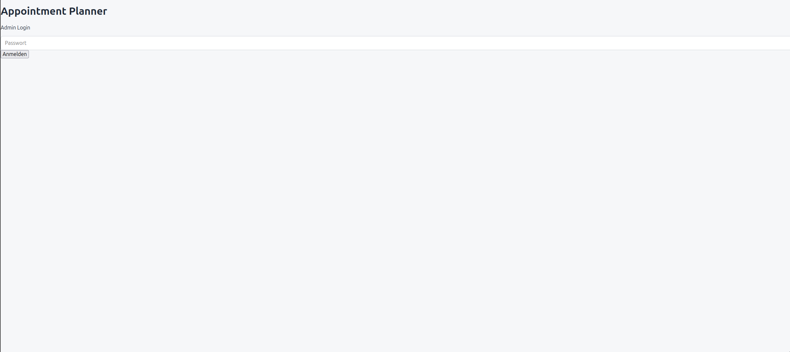
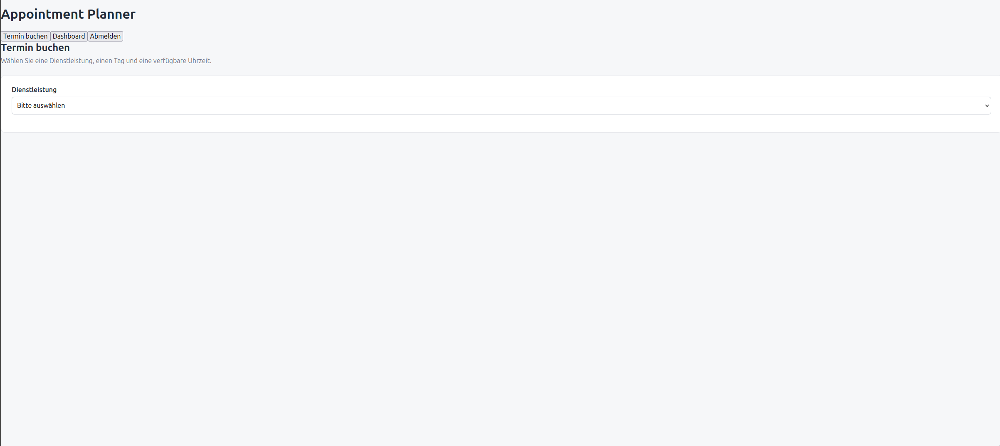
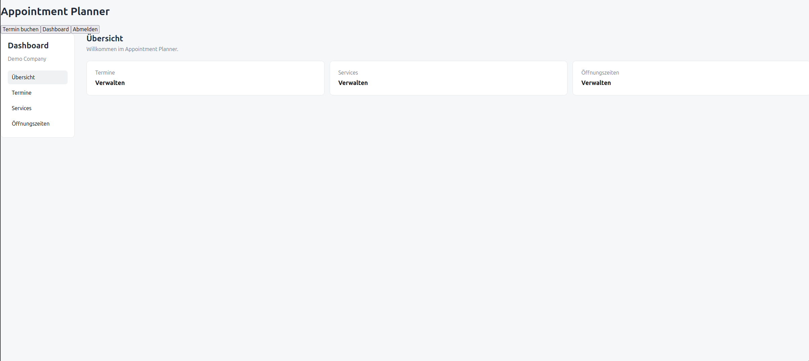
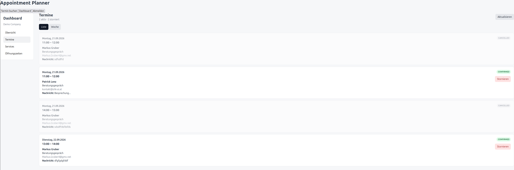
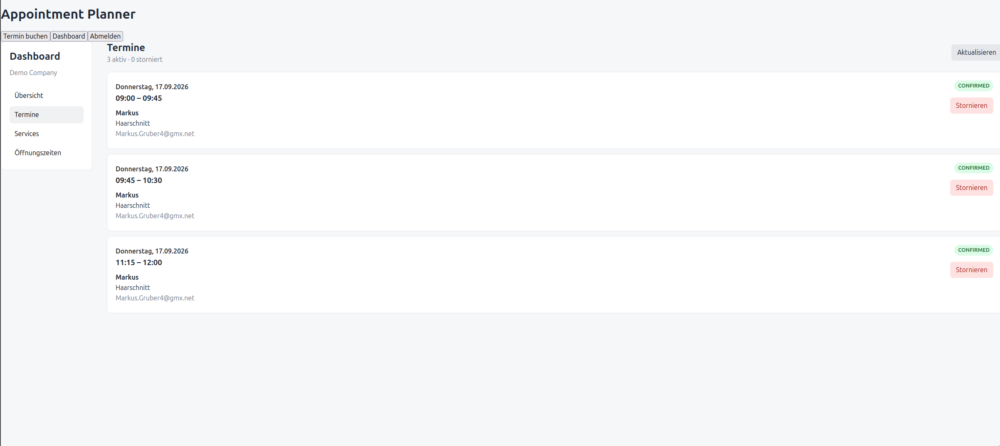

# Appointment Planner

A containerized appointment booking application designed for small businesses and service providers.

The application allows customers to book available appointments online while providing operators with a dashboard for managing services, availability and appointments.

This repository contains the public project documentation and showcase material. The application source code is maintained separately.

## Overview

The Appointment Planner is a full-stack web application built with a React frontend, a Fastify API and PostgreSQL.

The application is designed around a simple booking workflow:

1. Select a service
2. Select a date
3. Select an available time slot
4. Enter customer details
5. Confirm the appointment

Operators can manage the application through a dedicated dashboard.

## Screenshots

<table>
  <tr>
    <td align="center">
      
      <br>
      <b>Login</b>
    </td>

    <td align="center">
      
      <br>
      <b>Booking</b>
    </td>
  </tr>

  <tr>
    <td align="center">
      
      <br>
      <b>Dashboard</b>
    </td>

    <td align="center">
      
      <br>
      <b>Dashboard 2</b>
    </td>

    <td align="center">
      
      <br>
      <b>Appointments</b>
    </td>
  </tr>
</table>

## Features

### Customer Booking

* Service selection
* Date selection
* Available appointment slots
* Customer name and email
* Booking confirmation
* Email confirmation after successful booking

### Operator Dashboard

* View appointments
* Manage services
* Configure availability
* Cancel appointments
* Receive booking notifications

### Backend

* REST API
* PostgreSQL persistence
* Prisma ORM
* Timezone-aware appointment handling
* AWS SES email integration

## Technology Stack

| Area             | Technology                   |
| ---------------- | ---------------------------- |
| Frontend         | React, TypeScript, Vite      |
| Backend          | Node.js, TypeScript, Fastify |
| Database         | PostgreSQL                   |
| ORM              | Prisma                       |
| Email            | AWS SES                      |
| Containerization | Docker, Docker Compose       |
| Cloud            | AWS EC2, IAM                 |
| AWS Region       | eu-central-1                 |

## Architecture

The application follows a containerized architecture with separate frontend, backend and database components.

```text
                    ┌──────────────────┐
                    │     Customer     │
                    │     Browser      │
                    └────────┬─────────┘
                             │
                             ▼
                    ┌──────────────────┐
                    │     Frontend     │
                    │ React / Vite     │
                    └────────┬─────────┘
                             │
                             ▼
                    ┌──────────────────┐
                    │       API        │
                    │ Fastify / Node   │
                    └───────┬───┬──────┘
                            │   │
                    ┌───────┘   └──────────────┐
                    ▼                          ▼
             ┌──────────────┐           ┌──────────────┐
             │ PostgreSQL   │           │   AWS SES    │
             │   Database   │           │    Email     │
             └──────────────┘           └──────────────┘
```

## AWS Deployment

The current MVP is deployed to AWS using a containerized EC2 environment.

The deployment demonstrates:

* Amazon EC2
* Docker and Docker Compose
* IAM roles
* Amazon SES
* PostgreSQL
* AWS regional deployment

The current architecture is intentionally kept simple for the MVP. Future iterations can move individual components toward managed AWS services such as ECS/Fargate and Amazon RDS.

## Project Goals

The project was built to explore and demonstrate practical experience with:

* Full-stack application development
* REST API design
* Relational database design
* Containerization
* AWS infrastructure
* Cloud deployment
* IAM permissions
* Transactional email
* Timezone-aware business logic
* Service-oriented architecture

## Future Improvements

Planned improvements include:

* HTTPS and custom domain
* Server-side authentication and authorization
* Improved security hardening
* Managed PostgreSQL using Amazon RDS
* Container deployment using ECS/Fargate
* CI/CD automation
* Improved monitoring and logging
* Improved appointment conflict handling
* Production-ready service architecture

## Portfolio Context

The Appointment Planner is part of a broader portfolio of cloud-based software projects.

The long-term architecture is designed around independently deployable business services such as:

* Appointment
* Notification
* Billing
* Invoice
* Accounting
* CRM
* Reporting
* AI-assisted services

The projects are designed to demonstrate practical software engineering and cloud architecture rather than a single monolithic application.

## Source Code

The application source code is maintained separately from this public portfolio repository.

This directory contains only publicly shareable documentation, screenshots, architecture information and project material.

No credentials, secrets, private keys, customer data or other confidential information are included.

